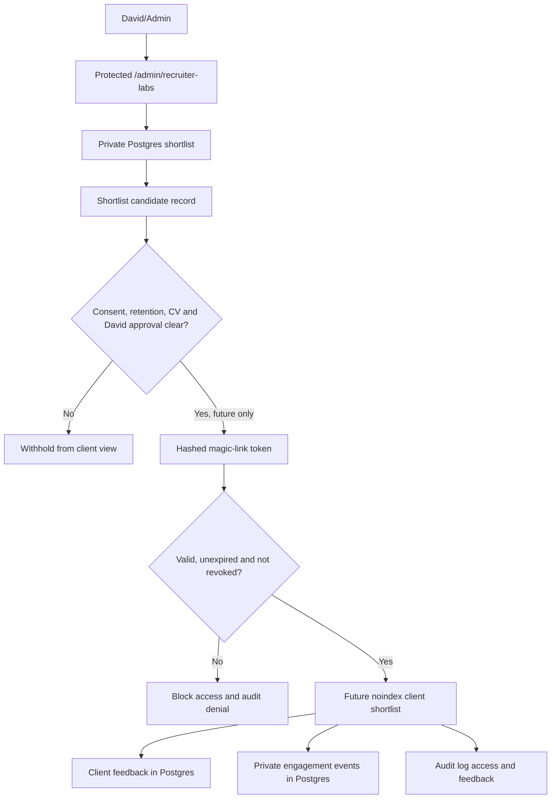

# Recruiter Labs Client Pipeline Launch Gate

## Status

Private admin testing only.

This is not safe for real clients yet. The foundation is useful, but the client
portal must stay closed until token validation, private CV access, audit proof
and legal/privacy review are complete.

This is technical implementation guidance, not legal advice.

## What This Gate Covers

Recruiter Labs may eventually handle:

- candidate data
- CV metadata and future private file access
- client shortlist access
- client feedback
- interview requests
- WhatsApp and Google scheduling references
- AI-assisted candidate summary drafts
- audit logs
- consent and retention decisions

That means the launch bar is higher than a normal marketing page.

## Current Decision

Safe now:

- admin-only planning and review
- feature-flag visibility checks
- schema and documentation review
- private beta preparation without real client access

Not safe yet:

- sending a client a shortlist link
- exposing candidate profiles to clients
- exposing CV access
- automating WhatsApp or Google Calendar interview logistics
- publishing AI-written candidate summaries without David approval

## Launch Checklist

### Private Routing

- Passed: `/admin/recruiter-labs` is protected by the CMS session gate.
- Passed: `/admin/recruiter-labs` is noindexed.
- Passed: `/client` is blocked in `robots.txt`.
- Passed: `/client/shortlist/[token]` is staged, noindexed and absent from
  sitemap.
- Passed: the staged route shows safe invalid, expired, revoked, disabled,
  rate-limited and not-ready states without exposing the raw token.
- Passed: feedback action UI and `/api/client-shortlist-feedback` are staged
  behind `FEATURE_SHORTLIST_FEEDBACK_TRACKING=false`.
- Passed: no Recruiter Labs route appears in `sitemap.xml`.
- Blocked: real client use still needs Railway Postgres, audit proof, private
  CV access, legal/privacy review and David approval before the feature flag is
  switched on.

### Candidate Consent

- Passed: candidate/application consent fields exist in the private operations
  schema.
- Passed: Recruiter Labs candidate share logic blocks missing consent.
- Passed: named sharing requires a candidate sharing consent timestamp.
- Passed: anonymised mode is modelled as a safer presentation option.
- Blocked: final candidate sharing wording needs legal/privacy review.
- Blocked: live candidate consent capture for shortlist sharing is not built.

### CV Security

- Passed: CVs are not stored in `/public`.
- Passed: file metadata is private operations data, not Sanity content.
- Passed: future CV access can be marked required, approved or revoked.
- Blocked: private object storage is not live.
- Blocked: signed/authenticated CV access routes are not live.
- Blocked: `cv_viewed` and `cv_downloaded` cannot be proven until CV routes are
  implemented.

### David's Take Audio Notes

- Staged: private audio-note metadata, approval states and access-log tables now
  exist in Postgres.
- Staged: admin and client audio-note API routes fail closed until storage,
  compression and signed playback are built.
- Blocked: private object storage, signed/authenticated playback, transcript
  handling, retention and legal/privacy wording still need approval.
- Passed: no audio note is stored in Sanity and no public audio URL is created.

### Audit Logging

- Passed: central audit logging utility exists.
- Passed: audit sanitisation redacts tokens, signed URLs, storage keys and CV
  content.
- Passed: Recruiter Labs audit action names are typed.
- Passed: staged feedback writes call `recruiter_labs_feedback_created` without
  raw token, GA4 data or free-text comment in audit metadata.
- Manual review: Railway Postgres must be enabled and migrated before audit
  proof is production-ready.
- Blocked: future client access, feedback, interview request and CV access
  routes must call `logAuditEvent`.

### AI Safety

- Passed: AI candidate summary flags are server-only and off by default.
- Passed: profile status requires David approval before client visibility.
- Passed: no auto-ranking has been added.
- Passed: no automated candidate evaluation has been added.
- Blocked: final AI prompt rules, provider approval, consent wording and human
  review workflow must be reviewed before any AI output reaches a client.
- Blocked: the AI launch gate in
  `docs/recruiter-labs-ai-launch-gate.md` must be cleared before real
  candidate data or client-facing AI output is used.

### WhatsApp Safety

- Passed: WhatsApp Business automation is server-side only.
- Passed: it is disabled unless `WHATSAPP_BUSINESS_ENABLED=true` and required
  server env vars are present.
- Passed: operational contact consent is required for current automated message
  attempts.
- Passed: WhatsApp CRM sync is separately gated behind
  `FEATURE_WHATSAPP_CRM_SYNC=false`.
- Passed: inbound webhook parsing stores safe metadata only and does not store
  raw WhatsApp message text.
- Passed: interview logistics automation is limited to operational templates
  and falls back to manual/email when consent, preference, time or configuration
  is missing.
- Blocked: interview scheduling templates need Meta review and David approval
  before use.
- Blocked: live webhook-to-candidate matching needs Meta app secret, Railway
  Postgres migrations, privacy/legal review and David approval before use.

### Google Safety

- Passed: public booking links are configurable.
- Passed: no Google password sharing or hardcoded OAuth secret has been added.
- Blocked: Calendar/Meet orchestration is not built.
- Blocked: scoped OAuth, approval steps and manual fallback need sign-off before
  live scheduling automation.

### Analytics Boundary

- Passed: website analytics is consent-aware.
- Passed: no candidate PII should go to GA4/GTM.
- Passed: token decisions are server-side and must not be logged as raw token
  values.
- Staged: private portal engagement events now write to Postgres only when the
  portal, feedback tracking and database gates are all on.
- Blocked: real client use still needs privacy wording, retention rules and
  admin access review before David enables private engagement tracking.

## Data Flow



## Feature Flags

All Recruiter Labs flags are server-side and off unless explicitly set to
`true`.

```txt
FEATURE_RECRUITER_LABS_ENABLED=false
FEATURE_CLIENT_PRESENTATION_PORTAL=false
FEATURE_BRANDED_CANDIDATE_PROFILES=false
FEATURE_SHORTLIST_FEEDBACK_TRACKING=false
FEATURE_INTERVIEW_REQUEST_WORKFLOW=false
FEATURE_WHATSAPP_INTERVIEW_SCHEDULING=false
FEATURE_WHATSAPP_CRM_SYNC=false
FEATURE_GOOGLE_MEET_INTERVIEW_SCHEDULING=false
FEATURE_AI_CANDIDATE_SUMMARIES=false
FEATURE_DAVIDS_AUDIO_NOTES=false
FEATURE_AI_CANDIDATE_SUMMARY_DRAFTS=false
```

These are not legal or security approval switches. A flag turning on must still
pass this launch gate.

## Environment Variables

Required before private operations are meaningful:

```txt
DATABASE_URL=
OPERATIONS_DB_ENABLED=true
OPERATIONS_PRIVACY_SALT=
CMS_GATE_USERNAME=
CMS_GATE_PASSWORD=
CMS_GATE_SECRET=
```

Optional, disabled until approved:

```txt
WHATSAPP_BUSINESS_ENABLED=false
WHATSAPP_BUSINESS_PHONE_NUMBER_ID=
WHATSAPP_BUSINESS_ACCESS_TOKEN=
WHATSAPP_BUSINESS_VERIFY_TOKEN=
WHATSAPP_BUSINESS_APP_SECRET=
FEATURE_WHATSAPP_INTERVIEW_SCHEDULING=false
FEATURE_WHATSAPP_CRM_SYNC=false
WHATSAPP_BUSINESS_INTERVIEW_CONFIRMATION_TEMPLATE=
WHATSAPP_BUSINESS_INTERVIEW_REMINDER_TEMPLATE=
WHATSAPP_BUSINESS_INTERVIEW_RESCHEDULE_TEMPLATE=
WHATSAPP_BUSINESS_INTERVIEW_LOCATION_TEMPLATE=
WHATSAPP_BUSINESS_INTERVIEW_AVAILABILITY_TEMPLATE=
FEATURE_GOOGLE_MEET_INTERVIEW_SCHEDULING=false
FEATURE_AI_CANDIDATE_SUMMARIES=false
FEATURE_DAVIDS_AUDIO_NOTES=false
FEATURE_AI_CANDIDATE_SUMMARY_DRAFTS=false
```

Never commit real secrets.

## Database Changes

Migration:

```txt
database/migrations/007_recruiter_labs_launch_gate.sql
```

Adds:

- shortlist launch-gate status
- launch-gate reviewer and review timestamp
- client visibility timestamp
- rollback timestamp and reason
- candidate sharing mode
- candidate sharing consent timestamp
- CV access required/approved/revoked fields
- shortlist candidate retention status
- client visibility and withholding fields

Default stance:

- shortlist launch gate starts as `blocked`
- candidate retention starts as `pending_review`
- CV access starts as not approved

## Manual QA Checklist

Before private beta:

- confirm unauthenticated `/admin/recruiter-labs` redirects to `/cms`
- confirm `/admin/recruiter-labs` is noindexed
- confirm `/client` remains blocked in `robots.txt`
- confirm `/client/shortlist/[token]` is noindexed
- confirm no Recruiter Labs/client route appears in `sitemap.xml`
- confirm feedback buttons remain disabled until
  `FEATURE_SHORTLIST_FEEDBACK_TRACKING=true`
- confirm decline requires one structured reason
- confirm database migrations have run on Railway
- confirm audit log writes are visible in `/admin/audit`
- confirm no raw token, signed URL, CV content or storage key appears in logs
- confirm candidate sharing is blocked without consent
- confirm candidate sharing is blocked without David approval
- confirm candidate sharing is blocked when retention status is unsafe
- confirm CV access is blocked unless explicitly approved
- confirm revoked CV access blocks sharing
- confirm WhatsApp automation stays disabled unless approved
- confirm Google Calendar/Meet automation stays manual unless approved
- confirm AI summaries remain draft until David approves them

Before real client use:

- test invalid token access
- test expired token access
- test revoked token access
- test valid token access
- test no token appears in analytics, audit metadata, server logs or URLs beyond
  the inbound request
- test client shortlist page has noindex metadata
- test client feedback writes to Postgres
- test feedback writes an audit event
- test feedback creates an admin task and private activity record
- test decline feedback stores a structured reason
- test feedback never sends token, candidate names or comments to GA4
- test CV view and download write audit events
- test rollback revokes access and hides client visibility
- test mobile and keyboard-only access for any client view
- test DSAR and deletion implications for shortlist records

## Rollback Plan

If anything looks wrong:

1. Set every Recruiter Labs feature flag to `false`.
2. Revoke affected rows in `recruiter_lab_client_access_tokens`.
3. Set affected shortlists to `launch_gate_status='rolled_back'`.
4. Set `rollback_at` and `rollback_reason`.
5. Remove or withhold affected shortlist candidates.
6. Confirm `/client` routes are blocked or removed.
7. Review `/admin/audit`.
8. Tell affected people only after David has approved the wording.

## Known Risks

- The current CMS gate is not a full role-based admin system.
- Private object storage is not live.
- The client portal route is staged, but real client access is not approved.
- Feedback capture is staged, but must remain disabled until David approves the
  private beta.
- Candidate shortlist-sharing consent wording is not legally signed off.
- Audit proof depends on Railway Postgres being configured and migrated.
- AI workflow rules need final review before client use.
- WhatsApp and Google scheduling should remain manual until reviewed.

## Legal Review Items

David must approve or obtain advice on:

- candidate consent wording for client presentation
- candidate privacy notice wording
- client access terms
- retention periods for shortlist/profile/feedback records
- audit log retention
- CV access and revocation process
- DSAR and deletion handling for shortlists
- WhatsApp template wording
- Google Calendar/Meet data handling
- AI-assisted summary wording and review process

## Final Engineering View

Safe for private admin testing: yes.

Safe for real clients: no.

What must happen before live use:

- build and test the token route
- enable signed/private CV access
- prove audit logging in production
- capture explicit candidate sharing consent
- keep AI output draft until David approves it
- complete legal/privacy review
- run the full QA checklist above

Private first. Test safely. Launch deliberately. No faff.
